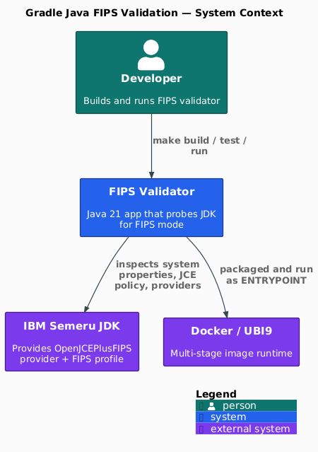

[](https://github.com/AndriyKalashnykov/gradle-java-simple/actions/workflows/ci.yml)
[](https://hits.sh/github.com/AndriyKalashnykov/gradle-java-simple/)
[](https://opensource.org/licenses/MIT)
[](https://app.renovatebot.com/dashboard#github/AndriyKalashnykov/gradle-java-simple)

# FIPS 140-3 Validation for IBM Semeru JDK 21

A **Gradle** / **Java 21** reference check that validates [FIPS 140-3](https://csrc.nist.gov/projects/cryptographic-module-validation-program) compliance on the **IBM Semeru** JDK — detecting FIPS mode via JDK system properties, JCE crypto policy, and registered security providers. Ships as a **Trivy**- and **cosign**-hardened **UBI9 Docker image**, with **integration tests** exercising the runner under real `-Dsemeru.fips` flags, **gitleaks** secret scanning, and a **mise**-pinned toolchain kept current by **Renovate** in **GitHub Actions** CI.

<p align="center">
  
</p>

Source: [`docs/diagrams/context.puml`](docs/diagrams/context.puml) — C4-PlantUML. `make static-check` runs `diagrams-check` (PlantUML syntax) and `mermaid-lint` (inline Mermaid blocks in any `.md`); re-render the PNG via `docker run --rm -v $PWD:/work -w /work plantuml/plantuml -tpng docs/diagrams/context.puml -o out`.

## Tech Stack

| Component | Technology |
|-----------|------------|
| Language | Java 21 |
| JDK | IBM Semeru OpenJ9 (`semeru-openj9-21.0.10+7`) |
| Build | Gradle 9.6.0 (via `./gradlew`) |
| Toolchain | [mise](https://mise.jdx.dev/) — manages Java, Node, hadolint, act, gitleaks, trivy (single `.mise.toml`) |
| Test | JUnit Jupiter |
| Coverage | JaCoCo (60% threshold) |
| Lint | Checkstyle + hadolint |
| Format | google-java-format |
| CVE Scan | OWASP Dependency-Check |
| Filesystem Scan | Trivy |
| Secret Scan | gitleaks |
| Diagram Lint | [mermaid-cli](https://github.com/mermaid-js/mermaid-cli) (inline Mermaid blocks) + [PlantUML](https://plantuml.com/) (`docs/diagrams/*.puml`) |
| Runtime | IBM Semeru 21 FIPS (UBI9) |

## Quick Start

```bash
make deps-install # install the full mise-pinned toolchain (first time only)
make deps         # verify required build dependencies are available
make build        # build the project
make test         # run FIPS validator tests
make run          # run the application
```

## Prerequisites

| Tool | Version | Purpose |
|------|---------|---------|
| [GNU Make](https://www.gnu.org/software/make/) | 3.81+ | Build orchestration |
| [Git](https://git-scm.com/) | latest | Version control |
| [mise](https://mise.jdx.dev/) | latest | Toolchain version management (Java, Node, hadolint, act, gitleaks, trivy) |
| [Java (IBM Semeru)](https://developer.ibm.com/languages/java/semeru-runtimes/) | 21.0.10+ | JDK runtime and compiler (installed by `make deps-install`) |
| [Docker](https://docs.docker.com/get-docker/) | latest | Required for `image-*`, `ci-docker`, `trivy-fs`, `mermaid-lint` (optional for core build) |

Install the full mise-pinned toolchain — Java, Node, hadolint, act, gitleaks, trivy (first time only):

```bash
make deps-install
```

## Architecture

```text
app/src/main/java/org/example/
├── App.java                  # Main application (greeting/message)
├── FIPSValidator.java        # FIPS mode detection logic
└── FIPSValidatorRunner.java  # Standalone runner (Docker entry point)
```

`FIPSValidator` checks for FIPS mode via:
1. `semeru.fips` and `semeru.customprofile` system properties
2. JCE unlimited crypto policy
3. Red Hat FIPS property (`com.redhat.fips`)
4. Registered security providers (OpenJCEPlusFIPS)

## Usage

The Docker image uses the public IBM Semeru runtime from [IBM Container Registry](https://icr.io/appcafe):

```bash
docker pull icr.io/appcafe/ibm-semeru-runtimes:open-21-jre-ubi9-minimal
```

FIPS mode is activated by JVM flags:

```text
-Dsemeru.fips=true -Dsemeru.customprofile=OpenJCEPlusFIPS.FIPS140-3
```

To inspect FIPS providers interactively:

```bash
docker run --rm -it icr.io/appcafe/ibm-semeru-runtimes:open-21-jre-ubi9-minimal /bin/bash
java -version
grep "^security.provider" /opt/java/openjdk/conf/security/java.security
```

## Make Targets

### Build & Run

| Target | Description |
|--------|-------------|
| `make help` | List available tasks |
| `make deps` | Verify required build dependencies are available |
| `make deps-install` | Install the full mise-pinned toolchain — Java, Node, hadolint, act, gitleaks, trivy (Gradle comes from the wrapper) |
| `make deps-check` | Show required tools and installation status |
| `make build` | Build project (compile only, no tests) |
| `make test` | Run FIPS validator tests (`FIPSValidatorTest` only) |
| `make integration-test` | Run integration tests (spawn-JVM subprocess IT suite) |
| `make run` | Run project |
| `make clean` | Clean build artifacts |

### Code Quality

| Target | Description |
|--------|-------------|
| `make format` | Auto-format Java source code (google-java-format) |
| `make format-check` | Verify code formatting (CI gate) |
| `make lint` | Run Checkstyle and Dockerfile lint |
| `make secrets` | Scan for hardcoded secrets with gitleaks |
| `make trivy-fs` | Scan filesystem for vulnerabilities, secrets, and misconfigurations |
| `make mermaid-lint` | Validate Mermaid diagrams in markdown files |
| `make diagrams-check` | Syntax-check PlantUML diagrams under `docs/diagrams/` |
| `make check-java-alignment` | Verify the Java major version agrees across `.mise.toml`, `build.gradle`, `Dockerfile` |
| `make static-check` | Composite quality gate (check-java-alignment + format-check + lint + secrets + trivy-fs + mermaid-lint + diagrams-check + ci-mirror-check) |
| `make coverage-generate` | Run tests with coverage report |
| `make coverage-check` | Verify code coverage meets minimum threshold (> 60%) |
| `make coverage-open` | Open code coverage report in browser |
| `make cve-check` | Run OWASP dependency vulnerability scan (needs `NVD_API_KEY`) |
| `make cve-db-update` | Update vulnerability database manually |
| `make cve-db-purge` | Purge local database (forces fresh download) |

### Docker

Builds a multi-stage image: Gradle builder + IBM Semeru 21 FIPS runtime (UBI9).

| Target | Description |
|--------|-------------|
| `make deps-hadolint` | Install hadolint for Dockerfile linting |
| `make deps-gitleaks` | Install gitleaks for secret scanning |
| `make deps-trivy` | Install Trivy for security scanning |
| `make deps-docker` | Ensure Docker is installed |
| `make image-build` | Build Docker image |
| `make image-run` | Run Docker image |
| `make image-stop` | Stop running Docker container |
| `make image-build-run` | Build and run Docker image |
| `make image-smoke-test` | Run FIPS smoke test against an image (`IMAGE=...` to override) |
| `make image-push` | Push Docker image to registry |

Configure the push target with environment variables:

```bash
DOCKER_REGISTRY=docker.io DOCKER_REPO=myuser/myimage DOCKER_TAG=v1 make image-push
```

### CI

| Target | Description |
|--------|-------------|
| `make ci` | Run full CI pipeline locally (mirrors GitHub Actions) |
| `make ci-run` | Run GitHub Actions workflow locally using [act](https://github.com/nektos/act) |
| `make ci-docker` | Run full CI pipeline including Docker build |
| `make deps-act` | Install act for local GitHub Actions testing |
| `make release` | Create and push a new tag |

### Utilities

| Target | Description |
|--------|-------------|
| `make upgrade` | Check for dependency updates |
| `make deps-prune` | Show dependency tree for manual pruning review |
| `make deps-resolve-check` | Verify all declared dependencies resolve cleanly (CI gate) |
| `make ci-mirror-check` | Lint that CI workflow `run: make X` calls match Makefile reality (CI gate) |
| `make gradle-stop` | Stop all Gradle daemons |
| `make renovate-bootstrap` | Ensure Node is installed (via mise) |
| `make renovate-validate` | Validate Renovate configuration |
| `make tmux-session` | Launch tmux session with Claude |

## CI/CD

GitHub Actions (`.github/workflows/ci.yml`) runs on every push to `main`, tags `v*`, and pull requests.

| Job | Triggers | Steps | `needs:` |
|-----|----------|-------|----------|
| **changes** | push, PR, tags | `dorny/paths-filter` — sets `code` output for doc-only-skip gate | — |
| **static-check** | code change | `make static-check` | `changes` |
| **build** | code change | `make build`, `make run` | `changes`, `static-check` |
| **test** | code change | `make test`, `make coverage-check` | `changes`, `static-check` |
| **integration-test** | code change | `make integration-test` (spawn-JVM subprocess suite) | `changes`, `static-check` |
| **docker** | code change (push/sign tag-gated) | Build → Trivy scan → smoke test (incl. negative case) → (tag-only) push + cosign sign | `changes`, `build`, `test`, `integration-test` |
| **ci-pass** | all | Aggregate status gate (treats `skipped` as pass) | all above |

A cheap `changes` detector job gates the heavy jobs via `dorny/paths-filter` — doc-only PRs skip CI work cleanly and `ci-pass` still reports green. `build`, `test`, and `integration-test` run in parallel after `static-check` passes. The `docker` job builds and scans the image on every push; `push` and `cosign sign` only fire on tag pushes (`v*`). The workflow also supports `workflow_call` for reuse from other workflows.

A weekly [cleanup workflow](.github/workflows/cleanup-runs.yml) deletes old workflow runs and caches (retains 7 days, minimum 5 runs).

### Required Secrets and Variables

No user-configured secrets or variables are required. The `docker` job pushes to [GHCR](https://ghcr.io) at `ghcr.io/andriykalashnykov/gradle-java-simple/gradle-java-fips-test` using the auto-provided `GITHUB_TOKEN` (scoped via the job's `packages: write` permission). Cosign keyless signing uses OIDC via `id-token: write` and signs every tag emitted by `docker/metadata-action` (anchored to the manifest digest).

`NVD_API_KEY` is not required by CI (no job invokes `make cve-check`). It's only needed locally when running `make cve-check` or `make ci-run` — in both cases it's read from the local environment. Request one at [nvd.nist.gov](https://nvd.nist.gov/developers/request-an-api-key).

### Verifying image signatures

Released images are signed with [cosign](https://github.com/sigstore/cosign) keyless OIDC (no long-lived keys). Verify a published tag against its GitHub Actions provenance:

```bash
cosign verify \
  --certificate-identity-regexp "^https://github.com/AndriyKalashnykov/gradle-java-simple/\.github/workflows/ci\.yml@refs/tags/v.*$" \
  --certificate-oidc-issuer https://token.actions.githubusercontent.com \
  ghcr.io/andriykalashnykov/gradle-java-simple/gradle-java-fips-test:<tag>
```

[Renovate](https://docs.renovatebot.com/) keeps dependencies up to date with platform automerge enabled.

## Contributing

Contributions welcome — open a PR.
